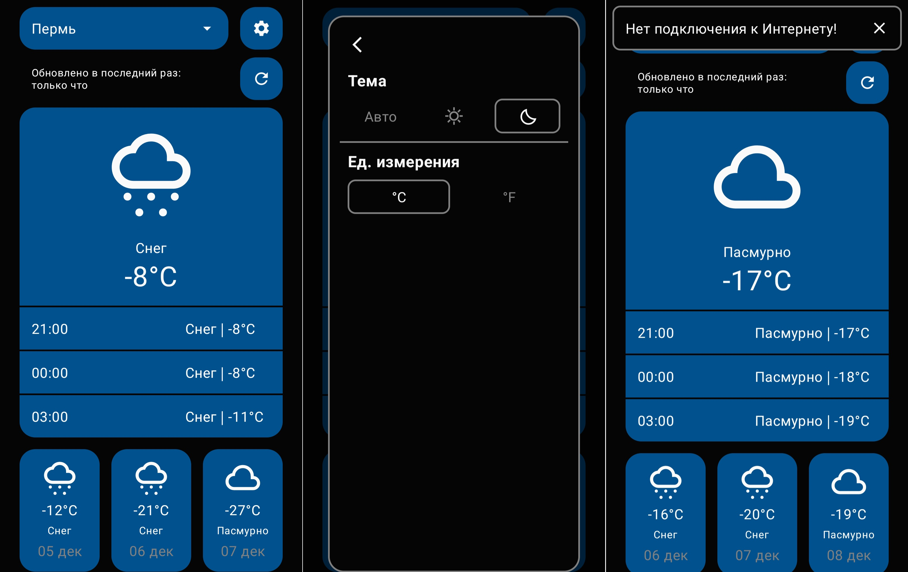
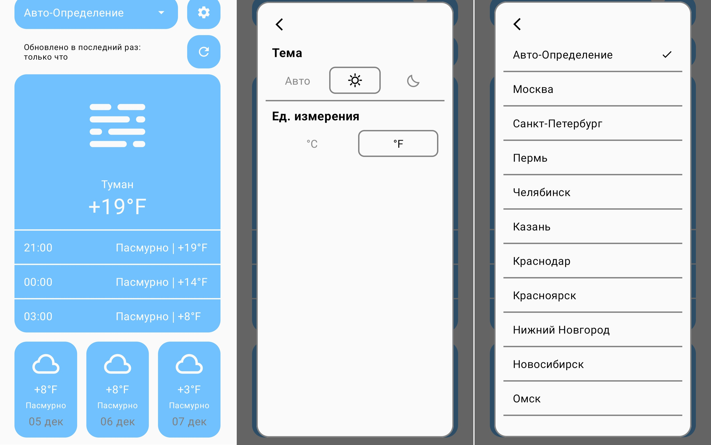

# Приложение Погоды

### Автор: Алексеев Вячеслав (ProsecShane)
> For English translation, scroll to the lower part

Приложение, которое позволяет узнать погоду.
Написано для **Android** с помощью **Kotlin**.

[**Скачать APK файл**](app/release/app-release.apk)

----

### Использованные технологии

Технологии разработки Android приложений, задействованные в проекте:
* IDE платформа и язык программирования
    * Android Studio
    * Kotlin
* Архитектура
    * MVVM
    * Coroutine и Flow
* UI
    * Jetpack Compose
    * Анимации
* Бэкенд
    * OpenWeatherMap API
* Network
    * Retrofit
* Хранение данных
    * Room
    * Shared Preferences
* Возможные дополнения
  [] Регулярные уведомления
  [] Полный список городов
  [] Виджет

**Если у вас остались какие-либо вопросы, можете писать мне сюда: prosecshane@yandex.ru**

----

# Weather App

### By: Alekseev Vyacheslav (ProsecShane)

A mobile app that tells the weather.
Made with **Kotlin** for **Android**.

[**Download APK file**](app/release/app-release.apk)

----

### Technologies Used

List of technologies for Android app development, that were used in this project:
* IDE and Programming Language
    * Android Studio
    * Kotlin
* Architecture
    * MVVM
    * Coroutine and Flow
* UI
    * Jetpack Compose
    * Animations
* Backend
    * OpenWeatherMap API
* Network
    * Retrofit
* Data storage
    * Room
    * Shared Preferences
* Possible future additions
  [] Notifications
  [] Full list of all cities
  [] Widget

**If you have any questions, you can contact me at prosecshane@yandex.ru**
